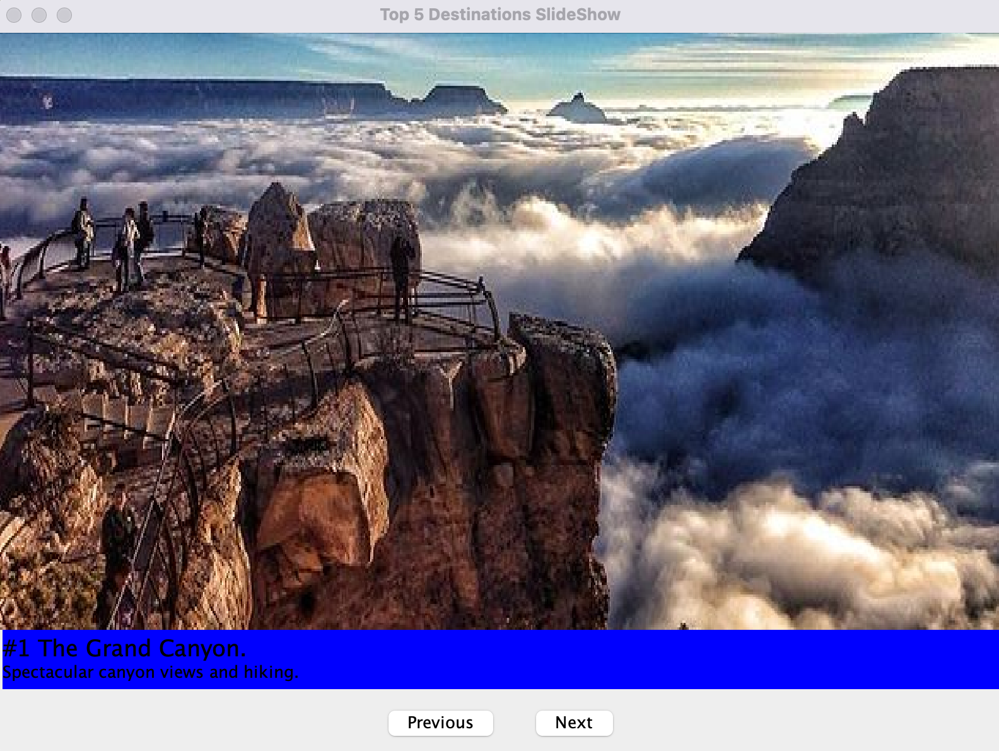
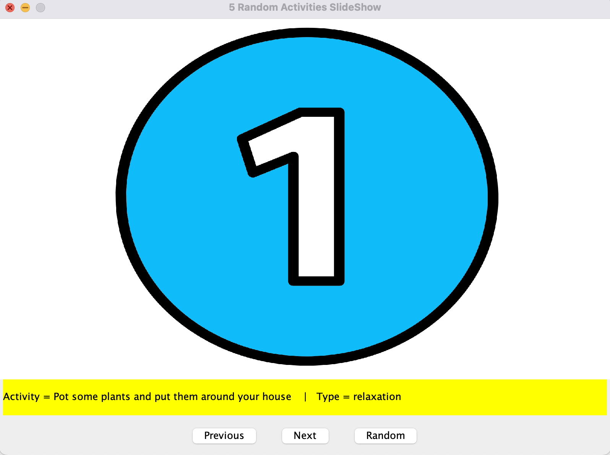

  

# 
CS499 - Computer Science Capstone

## 
Southern New Hampshire University

### 
Professional Self Assessment

Hello, my name is Daniel. I am living in Los Angeles, I own a digital marketing business, and I have been pursuing my degree in Computer Science here at Southern New Hampshire University for a few years now. I am currently 23, and as my program is coming to an end I am proud to say I have learned an abundant amount of skills usable in the industry. Technical skills I have learned are how to code in Python, Java, and C++, how to work with database management systems such as MongoDB and SQL, and how to work with data structures and algorithms within code. Some classes I really look back at are 1. My CS-260 Data Structures and Algorithms class, as it really taught me about time complexity and sorting algorithms 2. My CS-310 Collaboration and Team Project class, since we dove into team environments and how to comment out changes within the code and push them to git repositories 3. IT 315: Object Oriented Analysis and Design, because I learned how to work with classes and how to create object oriented projects. Aside from these courses, my CS-330 course dove into software engineering techniques a lot more in working with OpenGL. I also took a few cyber security courses which helped my mindset on security very much.
Practical skills I learned were not giving up on a project once it was started, planning ahead before starting a new project, and learning from mistakes to then apply them to future projects.
I was able to showcase my skills with each of the enhancements I made in three key areas; software engineering and design, data structures and algorithms, and databases. There were many bugs to fix and a lot of thinking that had to go into these changes, but it was well worth it. This was a very intimidating course to begin with but I have learned a lot through all of the enhancements I have made.
With each section of this ePortfolio I will be showcasing each enhancement and what skills were demonstrated through it. I have selected two artifacts to enhance, a Java Slideshow assignment, and a Vector Sorting assignment. I will be switching the core functionality of the Java Slideshow as well as adding a database to it, while also improving algorithmic functions on the Vector Sorting artifact.

### *Code Review*

Code review is essential when making updates to any project. Code review should go over the functionality of the original code, making sure there are no bugs and it is organized well. It should also go through the overal structure of the code, the logic and efficiency, its functionality, as well as the security and comment organization.
At the end of my code review I will go through how I will meet each category and course outcome, and which enhancements I plan to do.

View my code review video HERE.

## 
Artifact One Original

Here is the original Java Slideshow project. The code is written in Java and it displays in a basic Java GUI. This project is a slideshow that displays 5 destinations to visit, I thought it'd be a great project to enhance because it doesn't have any real appeal being that it displays the same 5 destinations every time.

This is the original artifact user interface:

  

View the artifact's original code HERE.

## 
Artifact One Enhanced

Here is the updated slideshow that implements an API to gather data from an online basis to display 5 random activities the user can do. Each time the application is run, 5 new activities are generated. Each activity generated will be appended to the SQL Lite database.

This is the enhanced artifact user interface:

  

View the artifact's enhanced code HERE.

## 
Artifact Two Original

Here is the original vector sorting project. This code is written in C++ and displayed in a terminal interface. The code is used to load data from a CSV file and sort it using two different algorithms. I

## 
Artifact Two Enhanced

### 
Three Main Categories

### *Software Design and Engineering*

### *Algorithms and Data Structures*

### *Databases*

### 
5 Course Outcomes

